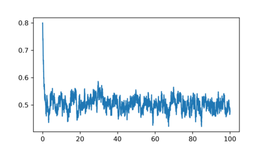

# ou_noise

A collection of functions for simulation and parameter estimation of 
Ornstein-Uhlenbeck processes.

## Installation 

Clone the repository and install the package with `pip install .`

## Usage

The following IPython session demonstrates the package usage.

    from ou_noise import ou
    import numpy
    import matplotlib.pyplot as plt
    %matplotlib

    t = numpy.arange(0, 100, 0.01)
    # simulate a path of the OU process on a given grid t, starting with x_0 = 0.8
    ou.path(0.8, t, 2.0, 0.5, 0.05)                                           
    plt.plot(t,x)

    params = ou.mle(t, x)
    print(params)

    # Output: [2.09360033 0.49863601 0.04992896]

The plot generated by the above script:

## License

ou_noise is released under the GNU GENERAL PUBLIC LICENSE Version 3. 
See LICENSE file for details.

Copyright (c) 2016--2019 Julian Wergieluk